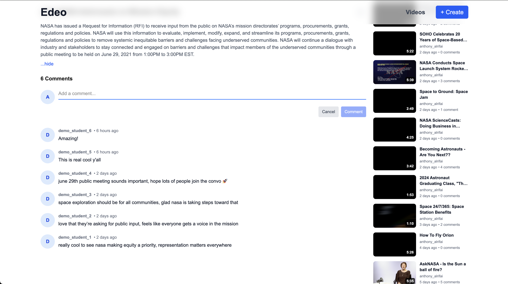

# Educational Video Player (Edeo)

A modern, feature-rich educational video platform built with Next.js that allows users to create, watch, and comment on educational videos. This project showcases advanced React patterns, custom video player implementation, and a polished user experience.


*Animated hero section with smooth scrolling*

## Overview

This application was developed as a technical showcase for an EdTech company, demonstrating skills in modern web development, UI/UX design, and API integration. The platform provides a seamless experience for educational content consumption with an intuitive interface and robust video player functionality.

## Features

### Video Management
- **Video Creation & Editing**: Create new videos with title, description, and video URL
- **Video Listing**: Browse and filter videos with sorting options (date, comments)
- **Video Details**: View comprehensive video information and metadata
- **Responsive Design**: Optimized for all device sizes

### Custom Video Player
- **Full Playback Control**: Play, pause, seek, and volume control
- **Animated UI Elements**: Smooth transitions and hover effects
- **Playback Speed Control**: Adjustable playback speeds (0.5x to 2x)
- **Volume Control**: Animated volume slider with mute functionality
- **Fullscreen Mode**: Double-click to enter/exit fullscreen
- **Auto-hiding Controls**: Controls fade out during playback
- **Keyboard Shortcuts**: Space bar for play/pause, arrow keys for seeking
- **Buffering States**: Visual feedback during video loading
- **Autoplay Support**: Automatic video playback when selected

### Interactive Features
- **Comment System**: Add and view comments on videos
- **Animated Comment Form**: Smooth form interactions
- **Real-time Updates**: Comments update dynamically
- **User Attribution**: Track comments by user

### User Experience
- **Splash Page**: Engaging landing page with hero section
- **Animated Header**: Header that hides/shows based on scroll
- **Loading Skeletons**: Elegant loading states throughout the app
- **Hover Previews**: Video previews on card hover
- **Modal System**: Smooth modal dialogs for video creation/editing
- **Error Handling**: Comprehensive error states and user feedback

### Technical Features
- **React Query Integration**: Efficient data fetching and caching
- **TypeScript**: Full type safety throughout the application
- **Custom Hooks**: Reusable logic for video player, keyboard controls, and more
- **Context Management**: Global state for modals and user preferences
- **Smooth Animations**: Powered by Motion (formerly Framer Motion)
- **Smooth Scrolling**: Lenis integration for buttery smooth page scrolling
- **Performance Optimized**: Video preloading, loading skeletons, and efficient rendering

## Future Optimizations

Some optimizations I would want to add:

- **Thumbnail Generation**: Need image URLs and other video metadata so we can load videos on hover rather than load all at once
- **Lazy Loading Images**: Implement lazy loading for video thumbnails to improve initial page load performance
- **Infinite Scroll**: Add pagination/infinite scroll for better performance with large video collections
- **Video Metadata Caching**: Cache video duration and dimensions to reduce repeated API calls

## Getting Started

### Prerequisites
- Node.js 18+ 
- npm, yarn, pnpm, or bun

### Installation

1. **Clone the repository**
   ```bash
   git clone <repository-url>
   cd educational-video-player
   ```

2. **Install dependencies**
   ```bash
   npm install
   # or
   yarn install
   # or
   pnpm install
   ```

3. **Run the development server**
   ```bash
   npm run dev
   # or
   yarn dev
   # or
   pnpm dev
   ```

5. **Open your browser**
   Navigate to [http://localhost:3000](http://localhost:3000)

### Building for Production

```bash
npm run build
npm start
```

## Usage

### Video Management
1. **Creating Videos**: Click the "Create Video" button to open the modal
2. **Editing Videos**: Use the dropdown menu on video cards to edit existing videos
3. **Viewing Videos**: Click on any video card to open the video player

### Video Player Controls
- **Play/Pause**: Click the video or press spacebar
- **Seek**: Click on the progress bar
- **Volume**: Use the volume slider
- **Fullscreen**: Double-click the video or use the fullscreen button
- **Speed**: Use the playback speed menu (0.5x - 2x)

### Comments
1. Scroll down on any video page to see existing comments
2. Use the comment form to add new comments
3. Comments are attributed to the configured `USER_ID`

## Technology Stack

- **Framework**: Next.js 15.5.2 with App Router
- **Language**: TypeScript
- **Styling**: Tailwind CSS 4
- **Animations**: Framer Motion
- **Data Fetching**: TanStack React Query
- **Smooth Scrolling**: Lenis
- **Date Handling**: Day.js

## Configuration

### User ID Setup
The application uses a configurable user ID system. To change the logged-in user:

1. Open `src/lib/config.ts`
2. Update the `USER_ID` constant:
   ```typescript
   export const USER_ID = 'your_desired_user_id';
   ```

**Note**: The application is pre-configured with `anthony_alrifai` as the USER_ID, which includes sample videos and comments that demonstrate the full functionality of the platform. This setup provides a realistic demonstration of the application's capabilities. You can change the USER_ID to any value to start with a fresh application state.

This affects:
- Video creation attribution
- Comment attribution
- User-specific video filtering

### API Configuration
The API endpoint is configured in `src/lib/config.ts`. The application is pre-configured to work with the provided API endpoint, so no additional setup is required.

## Screenshots

### Video Gallery

*Video cards with hover previews and loading skeletons*


*Loading skeletons for better user experience*

### Video Detail Page

*Video player with sidebar and comments*


*Loading state for video details*

### Video Player

*Fullscreen video playback with custom controls*

### Comments System

*Interactive comment system with animated form*

### Video Management

*Video creation modal with form validation*


*Video editing functionality*

### Mobile Experience

*Mobile-optimized landing page*


*Mobile video gallery layout*


*Mobile video detail view*

---

**Note**: This application requires a compatible backend API that supports the video and comment management endpoints as defined in the API integration layer.